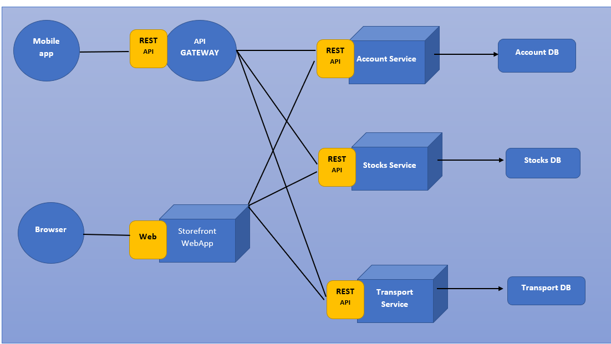

<h1 align="center">
   Spring Microservices Basic Conceptual Questions
</h1>

## Q1. What are Microservices?
Microservices - also known as the microservice architecture - is an architectural style that structures an application as a collection of services that are:

- Independently deployable
- Loosely coupled
- Organized around business capabilities
- Owned by a small team
The microservice architecture enables an organization to deliver large, complex applications rapidly, frequently, reliably and sustainably - a necessity for competing and winning in today’s world.

## Q2. Explain Monolithic Architecture
- An architecture that structures the application as a single deployable/executable component that uses a single database.
- The component contains all of the application’s subdomains

 ## Q3. What are the drawbacks of Monolithic Architecture?
- Difficult to understand and maintain due its the application’s size and complexity.
- Potentially less team autonomy - all teams are contributed to the same code base so they need to coordinate their work more often.
- Potentially slow deployment pipeline - since there’s a single large application that needs to be built and tested.
- Single technology stack - the application uses a single technology stack, which might not be ideal for all subdomains. If it the application is large upgrading the technology stack might be very time consuming.
- No possibility of segregating subdomains by their characteristics, which might reduce scalability, availabilty, security etc

 ## Q4. What are the different ways that services can communicate?
the different ways that services can communicate are:
- Messaging
- Remote Procedure Invocation

## Q5. Explain Messaging.
Messaging/ asynchronous messaging is used for inter-service communication. Services communicating by exchanging messages over messaging channels.

There are several different styles of asynchronous communication:

- Request/response - a service sends a request message to a recipient and expects to receive a reply message promptly
- Notifications - a sender sends a message a recipient but does not expect a reply. Nor is one sent.
- Request/asynchronous response - a service sends a request message to a recipient and expects to receive a reply message eventually
- Publish/subscribe - a service publishes a message to zero or more recipients
- Publish/asynchronous response - a service publishes a request to one or recipients, some of whom send back a reply

There are numerous examples of asynchronous messaging technologies.

- Apache Kafka
- Rabbit MQ

## Q6. Explain Remote Procedure Invocation (RPI)
RPI is used  for inter-service communication. The client uses a request/reply-based protocol to make requests to a service.

There are numerous examples of RPI technologies.
- REST
- Grpc
- Apache Thrift
 

## Q7. Difference between monolithic and microservice architecture.
| Aspect | Monolithic Architecture | Microservice Architecture |
|--------|-------------------------|---------------------------|
| Architecture | Style	Single, tightly-coupled codebase | Collection of small, independently deployable services |
| Scalability | Scaling the entire application | Scaling individual services independently |
| Deployment | Entire application deployed as one unit | Services deployed and updated independently |
| Technology Stack | Single technology stack for the entire application | Different services can use different technology stacks |
| Changes/Updates | Requires redeployment of the entire application | Individual services can be updated without affecting others |
| Fault Isolation | A failure affects the entire application | Failures are isolated to individual services |
| DevOps	| Simpler, centralized deployment and monitoring | Complex, decentralized deployment and monitoring |
| Inter-Process Communication | No communication overhead | Communication overhead due to service-to-service calls |
| Development Complexity | Relatively simpler development initially | Increased complexity in managing distributed systems |
| Cross-Cutting Concerns | Centralized implementation (e.g., logging, security) | Implemented separately in each service |
| Team Organization | Monolithic team working on the entire codebase | Multiple teams working on different services |
| Organizational Alignment | Suitable for smaller, less complex applications | Suitable for large, complex applications with evolving requirements |

## Q8. What are the Pros and Cons of Microservice architecture?
| Pros: Microservice architecture | Cons: Microservice architecture |
|---------------------------------|---------------------------------|
| Scalability: Individual services can be scaled independently based on demand, allowing for more efficient resource utilization. | Increased Complexity: Managing a distributed system with multiple services, inter-service communication, service discovery, and deployment can be complex |
| Fault Isolation:  If one service fails, it doesn't affect the entire application, improving overall system resilience and availability. | Distributed Data Management: Maintaining data consistency and implementing effective data management strategies across multiple services can be challenging. |
| Technology Flexibility: Different services can be built using different programming languages and technology stacks, allowing teams to choose the best tools for the job. | Operational Overhead: Tasks like service discovery, load balancing, monitoring, and logging require additional effort and tooling. |
| Improved Maintainability: Smaller, modular codebases are easier to understand, maintain, and evolve over time. | Inter-Service Communication: Communication between services can introduce performance overhead, latency, and potential points of failure. |
| Independent Deployment:  Services can be developed, tested, and deployed independently, enabling faster release cycles and continuous delivery. | Eventual Consistency: Maintaining strong consistency across multiple services can be challenging, leading to potential data inconsistencies. |
| Organizational Alignment: Services can be aligned with business capabilities or teams, promoting better organizational structure and autonomy. | Testing Complexity: Testing distributed systems and ensuring end-to-end scenarios work correctly can be more complex. |
| Technology Adoption: New technologies and frameworks can be adopted gradually by migrating or creating new services, reducing the risk of large-scale rewrites.	| Versioning and Contracts: Managing and evolving service contracts and versioning across multiple services can be challenging. | 

 
