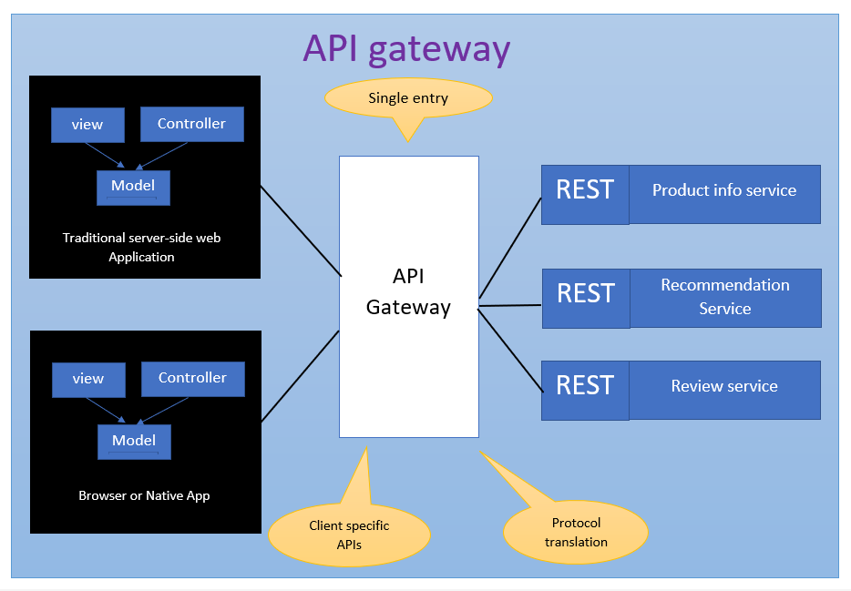
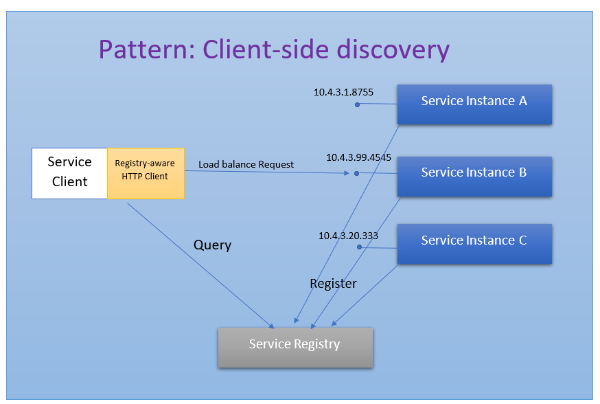
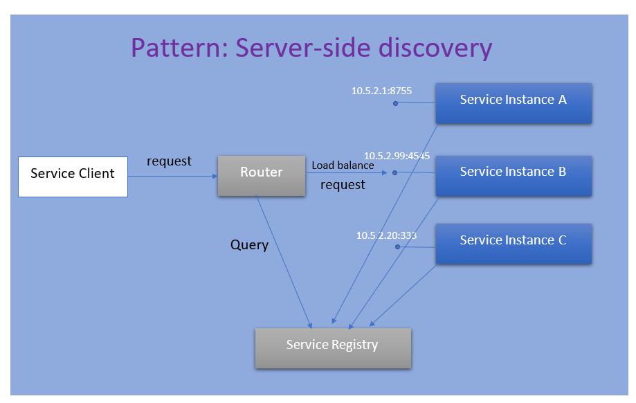
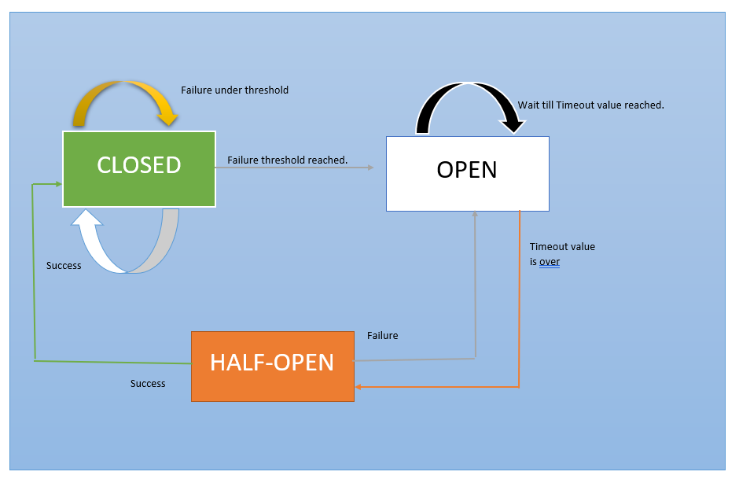

<h1 align="center">
  Communication and deployment strategies Conceptual Questions
</h1>

## Q1. Explain 2PC
Two-Phase Commit (2PC) is a protocol that provides a mechanism for coordinating transactions across multiple participants in a distributed system. This protocol is used to ensure the consistency of shared data and to prevent inconsistent data from being committed in the event of a failure.

Here's a high-level overview of how 2PC can be used in a database transaction:

- The transaction coordinator (TC) sends a request to all participating parties (e.g., databases, servers, or applications) to start the transaction.
- Each participating party responds to the TC to indicate whether it can commit the transaction or not. This is known as the "vote" phase.
- If all parties vote to commit the transaction, the TC sends a "commit" message to all parties.
- If any party votes to abort the transaction, the TC sends an "abort" message to all parties.
- If a party does not respond within a certain time frame, it is assumed to have voted to abort the transaction.
- If a party receives a "commit" message, it commits the transaction and responds to the TC with an acknowledgment.
- If a party receives an "abort" message, it aborts the transaction and responds to the TC with an acknowledgment.
- If the TC receives an acknowledgment from all parties, it confirms the completion of the transaction.

## Q2. What is an API Gateway
Imagine you are building an online store that uses the Microservice architecture pattern and that you are implementing the product details page. You need to develop multiple versions of the product details user interface:

- HTML5/JavaScript-based UI for desktop and mobile browsers - HTML will be generated by a server-side web application
- Native Android and iPhone clients - these clients interact with the server via REST APIs
- In addition, the online store must expose product details via a REST API for use by 3rd party applications.

**API Gateway**

- Insulates the clients from how the application is partitioned into microservices
- Insulates the clients from the problem of determining the locations of service instances
- Provides the optimal API for each client.
- Reduces the number of requests/roundtrips. For example, the API gateway enables clients to retrieve data from multiple services with a single round-trip. Fewer requests also means less overhead and improves the user experience. An API gateway is essential for mobile applications.
- Simplifies the client by moving logic for calling multiple services from the client to API gateway
- Translates from a “standard” public web-friendly API protocol to whatever protocols are used internally.

## Q3. Explain Service Discovery Pattern and the need for it
- Service Discovery Pattern is  a mechanism for that enables the clients of service to make requests to a dynamically changing set of ephemeral service instances..
- It helps the client of a service - 
  - for eg :the API gateway or another service - discover the location of a service instance.
  - the client obtains the location of a service instance by querying a Service Registry, which knows the locations of all service instances.

The need for it: 
  - Each instance of a service exposes a remote API such as HTTP/REST, or Thrift etc. at a particular location (host and port)
  - The number of services instances and their locations changes dynamically.
  - Virtual machines and containers are usually assigned dynamic IP addresses

There are 2 types of Service Discovery

Client-side service discovery

Server-side service discovery

eg: AWS Elastic Load Balancer

**Advantage:** Compared to client-side discovery, the client code is simpler since it does not have to deal with discovery. Instead, a client simply makes a request to the router

## Q4. Explain Circuit Breaker
Services sometimes collaborate when handling requests.

When one service synchronously invokes another there is always the possibility that the other service is
  - unavailable
  - exhibiting such high latency

it is essentially unusable.

Precious resources such as threads might be consumed in the caller while waiting for the other service to respond.

This might lead to resource exhaustion, which would make the calling service unable to handle other requests. The failure of one service can potentially cascade to other services throughout the application.

Below Image shows the state diagram of Circuit Breaker Pattern

## Q5. Explain the different deployment Strategies
Services can be packaged and deployed in multiple ways , below are 2 ways how it can be done

Single Service per Host and Multiple Services per Host

Single Service per Host: Deploy each single service instance on its own host

  - The benefits of this approach include:
  - Services instances are isolated from one another
  - There is no possibility of conflicting resource requirements or dependency versions
  - A service instance can only consume at most the resources of a single host
  - Its straightforward to monitor, manage, and redeploy each service instance

The drawbacks of this approach include:

  - Potentially less efficient resource utilization compared to Multiple Services per Host because there are more hosts.

Multiple Services per Host: Run multiple instances of different services on a host (Physical or Virtual machine).

There are various ways of deploying a service instance on a shared host including:

- Deploy each service instance as a JVM process. For example, a Tomcat or Jetty instances per service instance.
- Deploy multiple service instances in the same JVM. For example, as web applications or OSGI bundles.

 
## Q6. Explain Serverless deployment
**Serverless Services:**

- It uses a deployment infrastructure that hides any concept of servers (i.e. reserved or preallocated resources)- physical or virtual hosts, or containers. The infrastructure takes your service’s code and runs it. You are charged for each request based on the resources consumed.
- To deploy your service using this approach, you package the code (e.g. as a ZIP file), upload it to the deployment infrastructure and describe the desired performance characteristics.
- The deployment infrastructure is a utility operated by a public cloud provider. It typically uses either containers or virtual machines to isolate the services. However, these details are hidden from you. Neither you nor anyone else in your organization is responsible for managing any low-level infrastructure such as operating systems, virtual machines, etc.
- There are a few different serverless deployment environments:
  - AWS Lambda
  - Google Cloud Functions
  - Azure Functions
